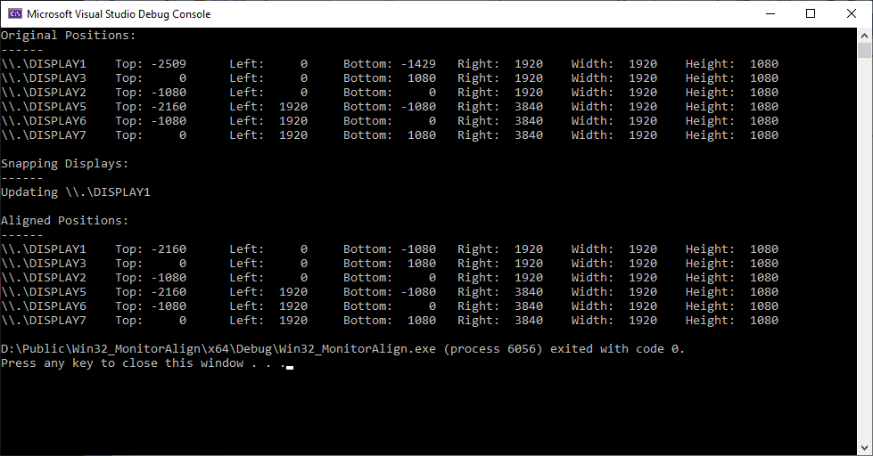

# Win32 Monitor Align

This is a C++ Win32 App for `Windows` and [sample solution](Win32_MonitorAlign.sln) for Visual Studio 2022. This app detects monitor positions and snaps to HD resolution locations to make sure there are no gaps between monitors.

The `Display Settings` on Windows has snapping but can create gaps between monitors which block the cursor from smoothly moving around the desktop.

The code is in [main.cpp](main.cpp).
